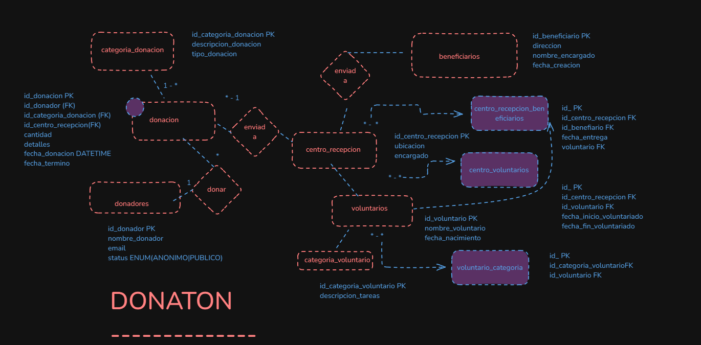
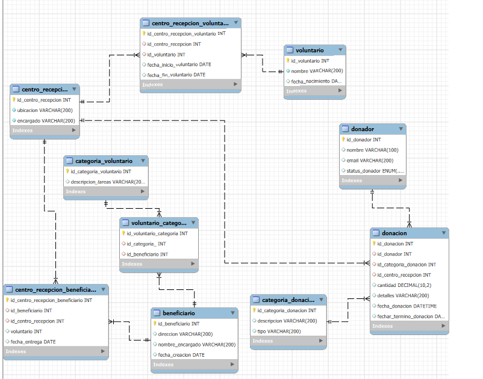

## PRIMER DER ONTOLOGICO DE CENTRO DE DONACIONES

## DER WORKBENCH

--- 
# Donaton Database

La base de datos `donaton` está diseñada para gestionar la información relacionada con donaciones, donadores, beneficiarios, centros de recepción y voluntarios en una organización de ayuda social. Facilita el seguimiento de las donaciones, la asignación de voluntarios y la distribución de los recursos a los beneficiarios.

## Tablas y Relaciones

### Tabla: `donador`
Almacena información de las personas que realizan donaciones.

- **Campos:**
  - `id_donador` (INT, PRIMARY KEY, AUTO_INCREMENT): Identificador único del donador.
  - `nombre` (VARCHAR(100)): Nombre del donador.
  - `email` (VARCHAR(200), UNIQUE): Correo electrónico del donador.
  - `status_donador` (ENUM): Estado del donador, puede ser "ANONIMO" o "PUBLICA".

- **Relación:**
  - Se relaciona con la tabla `donacion` como llave foránea.

### Tabla: `categoria_donacion`
Describe las categorías de las donaciones.

- **Campos:**
  - `id_categoria_donacion` (INT, PRIMARY KEY, AUTO_INCREMENT): Identificador único de la categoría.
  - `descripcion` (VARCHAR(200)): Descripción de la categoría de donación.
  - `tipo` (VARCHAR(200)): Tipo de donación.

- **Relación:**
  - Se relaciona con la tabla `donacion` como llave foránea.

### Tabla: `centro_recepcion`
Almacena información sobre los centros de recepción donde se reciben donaciones.

- **Campos:**
  - `id_centro_recepcion` (INT, PRIMARY KEY, AUTO_INCREMENT): Identificador único del centro de recepción.
  - `ubicacion` (VARCHAR(200), UNIQUE): Ubicación del centro.
  - `encargado` (VARCHAR(200)): Persona encargada del centro.

- **Relación:**
  - Se relaciona con las tablas `donacion`, `centro_recepcion_beneficiario` y `centro_recepcion_voluntario`.

### Tabla: `voluntario`
Almacena información sobre los voluntarios.

- **Campos:**
  - `id_voluntario` (INT, PRIMARY KEY, AUTO_INCREMENT): Identificador único del voluntario.
  - `nombre` (VARCHAR(200) NOT NULL): Nombre del voluntario.
  - `fecha_nacimiento` (DATE): Fecha de nacimiento del voluntario.

- **Relación:**
  - Se relaciona con la tabla `centro_recepcion_voluntario` como llave foránea.

### Tabla: `categoria_voluntario`
Define las categorías de tareas que pueden realizar los voluntarios.

- **Campos:**
  - `id_categoria_voluntario` (INT, PRIMARY KEY, AUTO_INCREMENT): Identificador único de la categoría de voluntario.
  - `descripcion_tareas` (VARCHAR(200)): Descripción de las tareas realizadas.

### Tabla: `beneficiario`
Almacena información de los beneficiarios que recibirán las donaciones.

- **Campos:**
  - `id_beneficiario` (INT, PRIMARY KEY, AUTO_INCREMENT): Identificador único del beneficiario.
  - `direccion` (VARCHAR(200)): Dirección del beneficiario.
  - `nombre_encargado` (VARCHAR(200)): Persona encargada del beneficiario.
  - `fecha_creacion` (DATE): Fecha de creación del beneficiario.

### Tabla: `donacion`
Registra las donaciones realizadas, asociándolas a un donador, categoría y centro de recepción.

- **Campos:**
  - `id_donacion` (INT, PRIMARY KEY, AUTO_INCREMENT): Identificador único de la donación.
  - `id_donador` (INT): Relación con el donador.
  - `id_categoria_donacion` (INT): Relación con la categoría de donación.
  - `id_centro_recepcion` (INT): Relación con el centro de recepción.
  - `cantidad` (DECIMAL(10,2)): Cantidad donada.
  - `detalles` (VARCHAR(200)): Detalles adicionales de la donación.
  - `fecha_donacion` (DATETIME, DEFAULT CURRENT_TIMESTAMP): Fecha de la donación.
  - `fechar_termino_donacion` (DATE): Fecha de término de la donación.

- **Relaciones:**
  - `id_donador` referencia a `donador(id_donador)`.
  - `id_categoria_donacion` referencia a `categoria_donacion(id_categoria_donacion)`.
  - `id_centro_recepcion` referencia a `centro_recepcion(id_centro_recepcion)`.

### Tabla: `centro_recepcion_beneficiario`
Asocia centros de recepción con beneficiarios para el registro de entregas de donaciones.

- **Campos:**
  - `id_centro_recepcion_beneficiario` (INT, PRIMARY KEY, AUTO_INCREMENT): Identificador único.
  - `id_beneficiario` (INT): Relación con el beneficiario.
  - `id_centro_recepcion` (INT): Relación con el centro de recepción.
  - `voluntario` (INT): Voluntario que realizó la entrega.
  - `fecha_entrega` (DATE): Fecha de la entrega.

- **Relaciones:**
  - `id_beneficiario` referencia a `beneficiario(id_beneficiario)`.
  - `id_centro_recepcion` referencia a `centro_recepcion(id_centro_recepcion)`.

### Tabla: `centro_recepcion_voluntario`
Registra los voluntarios asignados a cada centro de recepción.

- **Campos:**
  - `id_centro_recepcion_voluntario` (INT, PRIMARY KEY, AUTO_INCREMENT): Identificador único.
  - `id_centro_recepcion` (INT): Relación con el centro de recepción.
  - `id_voluntario` (INT): Relación con el voluntario.
  - `fecha_inicio_voluntario` (DATE): Fecha de inicio del voluntario en el centro.
  - `fecha_fin_voluntario` (DATE): Fecha de finalización del voluntario en el centro.

- **Relaciones:**
  - `id_centro_recepcion` referencia a `centro_recepcion(id_centro_recepcion)`.
  - `id_voluntario` referencia a `voluntario(id_voluntario)`.

### Tabla: `voluntario_categoria`
Asocia voluntarios con categorías específicas de tareas.

- **Campos:**
  - `id_voluntario_categoria` (INT, PRIMARY KEY, AUTO_INCREMENT): Identificador único.
  - `id_categoria_` (INT): Relación con la categoría de voluntario.
  - `id_beneficiario` (INT): Beneficiario asociado.

- **Relaciones:**
  - `id_categoria_` referencia a `categoria_voluntario(id_categoria_voluntario)`.
  - `id_beneficiario` referencia a `beneficiario(id_beneficiario)`.

## Problemática que Resuelve

La base de datos `donaton` permite a una organización de ayuda social gestionar el ciclo completo de donaciones, desde la recepción de los recursos hasta la entrega a los beneficiarios. Facilita:
- La administración de los donadores y sus contribuciones.
- El registro y seguimiento de las donaciones y su distribución.
- La gestión de los centros de recepción y la asignación de voluntarios.
- La identificación de los beneficiarios que recibirán las donaciones.

